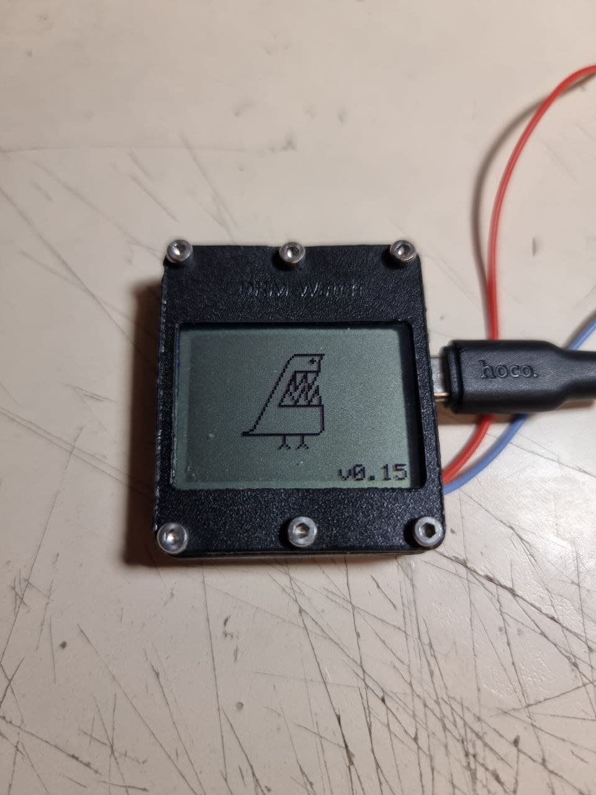

<!-- For new line: \ -->
<!-- Picture:   -->

# About project DRM Watch v2

Arduino-based watch with Nokia 1280 LCD. \
Main challenge of this project is packing as much
as possible stuff inside Arduino Nano with its 32KB of memory and 2KB RAM.\
Programming contributions made by <b>Dr. Failov</b>.\
Hardware design is made by <b>MeltemiOS</b>.

## About project > Features
- Low power consumption, while screen is always showing time;
- Charging over USB, battery status indication;
- Easy to get components needed to assemble;
- For now firmware is stable enough to use device daily;
- Case fits to default 20mm watch bands;
- No need to disassemble device for firmwate update;
- Device easily can be used as arduino playground: battery powered, equipped with 2 buttons, display, buzzer;
- Multiple Watchfaces, can be changed from menu;
- 2-button controlled graphic menu allow access to all functions;
- Alarm, can be set from menu;
- Monophonic melodies, can be used as alarm or played from menu;
- Stopwatch, can be accessed from menu;
- Time can be set from menu;
- Silent mode can be set from menu. Disable all sounds except alarm;
- Sound of pressing buttons can be set from menu;
- If needed, you can reboot watch by long-pressing "Up" button on watchface;
- Flip screen allows you to choose between left-hand and right-hand buttons position;
- Random decision helper: Zrada-Peremoga;
- Screen "About" shows credits and firmware version. Long-press will show you some debug information.

## About project > Photos of device
I have assembled few watches and using it as my everyday watch. Here`s some photos: \
      
  

## About project > Video overview
<b> TODO </b>

## About project > Overview of Watchfaces
You can change set of watchfaces in firmware. More info about it is "Software" block.

### Watchface "DRM Watch"
The first watchface in project, back from 2016. Inspired by iPod nano. \
Designed by <b>MeltemiOS</b>.
Updates once in second. Not very power-efficient. 
Takes about <b>486 bytes</b> of FLASH memory. \

### Watchface "DRM Lite"
"DRM Watch" without seconds. \
Designed by <b>Dr. Failov</b>.
Updates once in 8 seconds. Power-efficient. 
Takes about <b>430 bytes</b> of FLASH memory. \

### Watchface "Nomens"
Inspired by Siemens screensaver and Nokia home screen.\
Designed by <b>MeltemiOS</b>.
Updates once in 8 seconds. Power-efficient. 
Takes about <b>666 bytes</b> of FLASH memory. \

### Watchface "Zubat"
Project logo on watchface.\
Designed by <b>Dr. Failov</b>.
Updates once in 8 seconds. Power-efficient. 
Takes about <b>336 bytes</b> of FLASH memory. \

### Watchface "Xelibri"
Inspired by Siemens Xelibri product line. Very memory-hungry watchface.\
Designed by <b>MeltemiOS</b>.
Updates once in 8 seconds. Power-efficient. 
Takes about <b>1528 bytes</b> of FLASH memory. \

### Watchface "Matrix"
Inspired by Matrix film, like font on secret documents.\
Designed by <b>MeltemiOS</b>.
Updates once in 8 seconds. Power-efficient. 
Takes about <b>886 bytes</b> of FLASH memory. \

### Watchface "Life"
Conway's Game of Life as background.\
Designed by <b>Dr. Failov</b>.
Draws 10 frames every 8 seconds. Not Power-efficient, because of animation. 
Takes about <b>684 bytes</b> of FLASH memory. \

# Hardware

If you want to assemble your own DRM Watch, this block is for you! \
To assemble watch, you will need: <b>circuit board, parts or modules to desolder, case</b>. 
Also, some instruments, much time and some experience.

## Hardware > Used parts
- Arduino Nano (MEGA328P chip)
- Nokia 1280 LCD (PCF8814 chip)
- RTC module (DS3231M chip)
- Li-Po charger module (TC4056A chip)

To get components I've desoldered modules. \

### Arduino Nano, CH340C and MEGA328P
MEGA328P used as main controller.\
CH340C Is needed to allow programming with USB port.\
Link: https://aliexpress.ru/item/4000903444456.html  \
 

### Nokia 1280, PCF8814 LCD
Also, this display is used in: Nokia 1202, Nokia 1280, Nokia 1203.
And also compatible with Nokia 1100 LCD, Nokia 1101 LCD, Nokia 1110 LCD, but it will not fit with board.
Display is main output device. \
Link: https://aliexpress.ru/item/32864378445.html  \
 

### RTC module, DS3231M chip
DS3231M is needed to precisely calculate time. \
Link: https://aliexpress.ru/item/4000004876793.html  \
  

### Passive buzzer, 5.2mm x 5.2mm 
Buzzer allows to play sound signals and melodies. \
Link: https://aliexpress.ru/item/1005003227004618.html  \
  

### Board
I've ordered boards on JLC PCB. Actual version of gerber files to make your order see at `Circuit Board` folder. \
Here's what I got: \
(It's older revision on photo) \
   

## Hardware > Schematics
### Board gerber files
You can fing GERBER files for DRM Watch board in `Circuit Board` folder. \

### Board soldering plan, elements list and LCD pinout
Description of elements on board: \

### Atmel 328P chip pinout
You can use this schematic as reference. \

- D0 - UART RX
- D1 - UART TX
- D2 - Button DOWN (Active HIGH)
- D3 - Button UP (Active HIGH)
- D5 - LCD RST
- D6 - LCD CS
- D7 - LCD MOSI
- D8 - LCD SCK
- D9 - not used
- D10 - LCD Power
- D11 - USB Voltage    
- D12 - Buzzer (Passive)
- D13 - Debug LED
- A1(D15) - LCD Backlight (Active HIGH)
- A4 - RTC SDA
- A5 - RTC SCL

## Hardware > Case 3D Model
You can fing STL files for DRM Watch case in `Case` folder. \
 

## Hardware > Assembly instruction
General way to assemble watch:
- Assemble device
- Connect it to PC and flash firmware
- Select watchface 

Assembly video on YouTube:
https://youtu.be/IrAri0zF-KY

# Software
Description of software components and how to build.

## Software > Used libraries
### LCD1202
Used to run nokia display. Also may be compatible with this LCD controllers: `pcf8814`, `ste2007`, `ST7565`, `HX1230`.
Library included in this repo. Just copy it to your libraries folder (`C:\Users\USER\Documents\Arduino\libraries`). \
This library is modified, to allow display flip options and direct access to buffer. So use version of library that included in this repository.
Source: http://arduino.ru/forum/proekty/khronograf-izmeritel-skorosti-puli-ot-prostogo-k-slozhnomu?page=5#comment-136147
### Low-Power-master
Used to allow deep sleep between screen refreshing. 
Library included in this repo. Just copy it to your libraries folder (`C:\Users\USER\Documents\Arduino\libraries`). \
Source: https://github.com/rocketscream/Low-Power
### DS3231M-1.0.6
Used to communicate with RTC module.
Library included in this repo. Just copy it to your libraries folder (`C:\Users\USER\Documents\Arduino\libraries`). \
Source: https://www.arduino.cc/reference/en/libraries/ds3231m/

## Software > How to set watchfaces list
You can include multiple watcfaces in firmware. As much as enough FLASH memory.\
You can configure included wathfaces in file `_DRMWatch2.ino`.\
Update number of included watchfaces, comment or uncomment needed watchfaces, check memory usage.\
Example:\

## Software > How to add your own melodies
Because of Arduino have <b>VERY</b> limited space, but I want to store long melodies, I made algorythm to 
compress music as much as possible.\
As source I using Nokia-style composer music, named `RTTTL`.\
I made software to convert `RTTTL` to binary codes, which can be played by synthesizer of 
DRM Watch firmware.\
Melodies stored in form of one byte-one note. Array is contains tempo and notes.\
First 2 bits of note is representing note duration (values 4, 8, 16, 32).\
Last 6 bits represents note number counted from low note of first octave.\

# Project history
A long time ago...
## Project history > 2016, First steps
Back in 2016 me and my friend <b>MeltemiOS</b> was playing with arduino and Nokia 5110 LCD.
Then idea of DRM Watch was born. We've assembled one DIY working prototype and stopped development. \
Here's some prorotype photos of these days: \
  
   

## Project history > 2021, Development continued
Later, in 2021 for some reason project continued. 
LCD was changed to Nokia 1280 LCD, because it is easier to get and has more reliable connection. 
Here's some prototypes:\
  
  

--------------------------------------------------------------------------------------------
Next part of this page is not structured
--------------------------------------------------------------------------------------------
# Under development
--------------------------------------------------------------------------------------------

### Select WTF After flash firmware

To fix it, go to settings and select watchface from list.

### No device connected or Unrecognized device when connected

TODO

### No response from board when trying to flash firmware.

Check your Arduino. (if pin13 LED is blinking when power on, arduino is alive)
TODO

### RTC FAIL on startup

TODO

### Menu language
There is 2 options to select language: `Russian` and `English`.\
If you want use `Russian` language, uncomment `#define LANG_RU` string in main file.\
If you want use `English` language, uncomment `#define LANG_EN` string in main file.\
Only one string can be active at the time. If you select any language, you have to comment other one.

### How to add my own screen?
Program contains several screens (menus, watchfaces...).
Every screen is a separate mode. Every mode contains of: modeSetup(), modeLoop(), modeFinish().
Modes can work independently. Modes divided into different files to ease.
Function of main program `loop()` is routing `modeLoop()` to correct mode according to `_mode` value.
Also `setMode()` function is triggering `modeSetup()` and `modeFinish()` for every mode.
To change mode call: `setMode(MODE_INIT);`.
When adding new mode: 
- Create new file with `modeLoop()`, `modeSetup()`, and `modeFinish()` for your mode.
- Define constant for it in main file, like `#define MODE_MENU_SET_BEEP_SOUND (byte)9`.
- Add to main `loop()` call for your `modeLoop()`.
- Call your `modeSetup()` from `setMode()` when entering your mode.
- Call your `modeFinish()` from `setMode()` when leaving your mode.
- Call `setMode(YOUR_MODE);` when you want to enter your new screen.
- Don't forget to call `goToWatchface()` or `setMode()` to exit your mode if needed.

### How to add my own watchface?
Watchfaces is the same that Mode, but called from `goToWatchface()`.
- Create constant for your watchface in file `_DRMWatch2.ino`. Use not used previously number for your constant: `#define WATCHFACE_NOKIA 5`.
- Create file like `1WatchFaceNokia`.
- Create function like `void drawWatchFaceNokia(byte hour, byte minute, byte second, byte day, byte month, int year, byte dayOfWeek, byte animate)`.
- Add call of your `drawWatchFaceNokia` from file `1ModeWatchFace.ino` function `modeWatchFaceLoop`. 
Put this call under `#ifdef WATCHFACE_NOKIA` statement. Use other watchfaces as example.
- In file `ModeMenuSetWatchface.ino` function `modeMenuSetWatchfaceItemsCount()` add `cnt++;` for your watchface. 
This is needed to count active watchfaces and show correct number of menu items.
- Write script to draw yout watchface. You can only use non-blocking functions. 

### ModeInit
Initial mode. Its goal to init Serial, init display, init RTC, show startup animation, and go to watchface.
If RTC can not be initialized, watchface will not open.\

### ModeWatchFace
Whow time, date. Watchfaces is only screen with deep sleep, so device can run for a long time if in watchface mode.
Press button Up to turn on backlight. Press button down to open main menu.\

### ModeMenuMain
Main menu, opens when you click bottom button. If inactive for 120 sec, will automatically go to watchface.
Press button Up to select. Press button Down to move cursor down.\

### ModeMenuMelodies
Menu with list of melodies, which can be played. If inactive for 120 sec, will automatically go to watchface.
Press button Up to select. Press button Down to move cursor down.\

### ModeMenuSetTime
Menu to set correct time manually. There is no auto-exit from this menu, 
so if you leave watch untouched in this mode, it will discharge and power off.
Button down is moving field selection, button up is incrementing value.\

### ModeMenuSetSleepTime
Menu allows you to select interval of sleep in watchface. 
With less interval watchface will update more frequently, so battery will drain faster.
If inactive for 120 sec, will automatically go to watchface.
Press button Up to select. Press button Down to move cursor down.\

### ModeMenuSetBeepSound
Select sound of buttons.\

### ModeAbout
Information about developers and version.\

### ModeSetAlarm
You can select time and melody and alarm will play at that time. Alarm will start only if watchface is opened.\

### modeZrada
Genegates random conscusion: "Peremoga" or "Zrada". This is local Ukrainian meme.
"Peremoga" is "win", "Zrada" is "treason".
Mechanics the same as heads and tails.\

