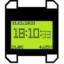

<!-- For new line: \ -->
<!-- Picture:   -->

# DRM_Watch v2

Arduino-based watch with Nokia 1280 LCD. \
Main challenge of this project is packing as much
as possible stuff inside Arduino Nano with its 15KB of memory.\
Programming contributions made by <b>Dr. Failov</b>.\
Hardware part is made by <b>MeltemiOS</b>.\
Watchfaces design drawn by <b>MeltemiOS</b>.\

## Functions
- 4 Watchfaces
- Menu screens
- Alert
- Play monophonic melodies
- Stopwatch
- Set time screen
- Set sleep time screen
- Set silent mode screen
- Set button sound screen
- Force reboot
- Zrada-Peremoga
- About screen

## Used components:

- Arduino Nano (MEGA328P chip)
- Nokia 1280 LCD (PCF8814 chip)
- RTC module (DS3231M chip)
- Li-Po charger module (TC4056A chip)

To get components I've desoldered modules. 

### Arduino Nano, CH340C and MEGA328P
MEGA328P used as main controller.\
CH340C Is needed to allow programming with USB port.\
Link: https://aliexpress.ru/item/4000903444456.html  \
 

### Nokia 1280, PCF8814 LCD
Also, this display is used in: Nokia 1202, Nokia 1280, Nokia 1203.
And also compatible with Nokia 1100 LCD, but it will not fit with board.
Display is main output device. \
Link: https://aliexpress.ru/item/32864378445.html  \
 

### RTC module, DS3231M chip
DS3231M is needed to precisely calculate time. \
Link: https://aliexpress.ru/item/4000004876793.html  \
  

### Passive buzzer, 5.2mm x 5.2mm 
Buzzer allows to play sound signals and melodies. \
Link: https://aliexpress.ru/item/1005003227004618.html  \
  

### Board
I've ordered boards on JLC PCB. Here's what I got:\
   

## Pinout

Pins list:
- D0 - UART RX
- D1 - UART TX
- D2 - Button DOWN (Active HIGH)
- D3 - Button UP (Active HIGH)
- D5 - LCD RST
- D6 - LCD CS
- D7 - LCD MOSI
- D9 - USB Voltage 
- D10 - LCD Power
- D11 - LCD SCK   
- D12 - Buzzer (Passive)
- D13 - Debug LED
- A1 - LCD Backlight (Active HIGH)
- A4 - RTC SDA
- A5 - RTC SCL

## Code description

### Menu language
There is 2 options to select language: `Russian` and `English`.\
If you want use `Russian` language, uncomment `#define LANG_RU` string in main file.\
If you want use `English` language, uncomment `#define LANG_EN` string in main file.\
Only one string can be active at the time. If you select any language, you have to comment other one.

### How to add my own screen?
Program contains several screens (menus, watchfaces...).
Every screen is a separate mode. Every mode contains of: modeSetup(), modeLoop(), modeFinish().
Modes can work independently. Modes divided into different files to ease.
Function of main program `loop()` is routing `modeLoop()` to correct mode according to `_mode` value.
Also `setMode()` function is triggering `modeSetup()` and `modeFinish()` for every mode.
To change mode call: `setMode(MODE_INIT);`.
When adding new mode: 
- Create new file with `modeLoop()`, `modeSetup()`, and `modeFinish()` for your mode.
- Define constant for it in main file, like `#define MODE_MENU_SET_BEEP_SOUND (byte)9`.
- Add to main `loop()` call for your `modeLoop()`.
- Call your `modeSetup()` from `setMode()` when entering your mode.
- Call your `modeFinish()` from `setMode()` when leaving your mode.
- Call `setMode(YOUR_MODE);` when you want to enter your new screen.
- Don't forget to call `goToWatchface()` or `setMode()` to exit your mode if needed.

### How to add my own watchface?
Watchfaces is the same that Mode, but called from `goToWatchface()`.
- Create file like `modeWatchFace2`.
- Create functions `Setup()`, `Loop()`, `Finish()` for `modeWatchFace2`.
- Create constant for this new mode.
- Call its functions from `setMode()` and `loop()`.
- Create item for your watchface in `ModeSetWatchface`.
- Call from goToWatchface(), if its number selected.
- Don't forget to copy or reuse backlight, sleep and exit to menu routines to make your watchface fully functional.

### Used Libraries

#### LCD1202
Used to run nokia display. Also may be compatible with this LCD controllers: `pcf8814`, `ste2007`, `ST7565`, `HX1230`.
Library included in this repo. Just copy it to your libraries folder (`C:\Users\USER\Documents\Arduino\libraries`).
Source: http://arduino.ru/forum/proekty/khronograf-izmeritel-skorosti-puli-ot-prostogo-k-slozhnomu?page=5#comment-136147

#### Low-Power-master
Used to allow deep sleep between screen refreshing. 
Library included in this repo. Just copy it to your libraries folder (`C:\Users\USER\Documents\Arduino\libraries`).

#### DS3231M-1.0.6
Used to communicate with RTC module.
Library included in this repo. Just copy it to your libraries folder (`C:\Users\USER\Documents\Arduino\libraries`).

## Mode description

### ModeInit
Initial mode. Its goal to init Serial, init display, init RTC, show startup animation, and go to watchface.
If RTC can not be initialized, watchface will not open.\

### ModeWatchFace1
Whow time, date. Watchfaces is only screen with deep sleep, so device can run for a long time if in watchface mode.
Press button Up to turn on backlight. Press button down to open main menu.\

### WatchFace1
Watchface 1

### WatchFace2
Watchface 2

### WatchFace3
Watchface 3

### WatchFace4
Watchface 4

### ModeMenuMain
Main menu, opens when you click bottom button. If inactive for 120 sec, will automatically go to watchface.
Press button Up to select. Press button Down to move cursor down.\

### ModeMenuMelodies
Menu with list of melodies, which can be played. If inactive for 120 sec, will automatically go to watchface.
Press button Up to select. Press button Down to move cursor down.\

### ModeMenuSetTime
Menu to set correct time manually. There is no auto-exit from this menu, 
so if you leave watch untouched in this mode, it will discharge and power off.
Button down is moving field selection, button up is incrementing value.\

### ModeMenuSetSleepTime
Menu allows you to select interval of sleep in watchface. 
With less interval watchface will update more frequently, so battery will drain faster.
If inactive for 120 sec, will automatically go to watchface.
Press button Up to select. Press button Down to move cursor down.\

### ModeMenuSetBeepSound
Select sound of buttons.

### ModeAbout
Information about developers and version.

### ModeSetAlarm
You can select time and melody and alarm will play at that time. Alarm will start only if watchface is opened.

### modeZrada
Genegates random conscusion: "Peremoga" or "Zrada". This is local Ukrainian meme.
"Peremoga" is "win", "Zrada" is "treason".
Mechanics the same as heads and tails.

### Mode

 
 
 
## Melodies converter
Because of Arduino have <b>VERY</b> limited space, byt I want to store long melodies, I made algorythm to 
compress music as much as possible.\
As source I using Nokia-style composer music, named `RTTTL`.\
I made software to convert `RTTTL` to binary codes, which can be played by synthesizer of 
DRM Watch firmware.\
Melodies stored in form of one byte-one note. Array is contains tempo and notes.\
First 2 bits of note is representing note duration (values 4, 8, 16, 32).\
Last 6 bits represents note number counted from low note of first octave.\

 
## Prototype photos:
     
     